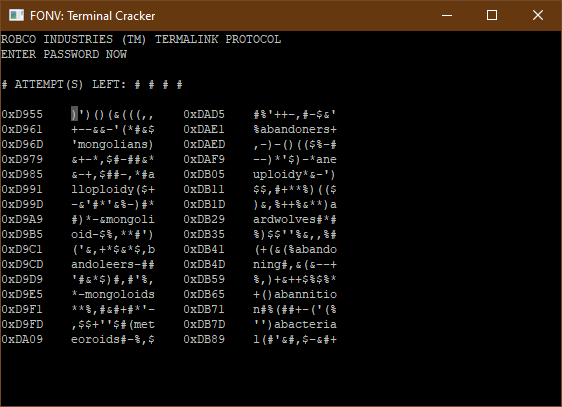
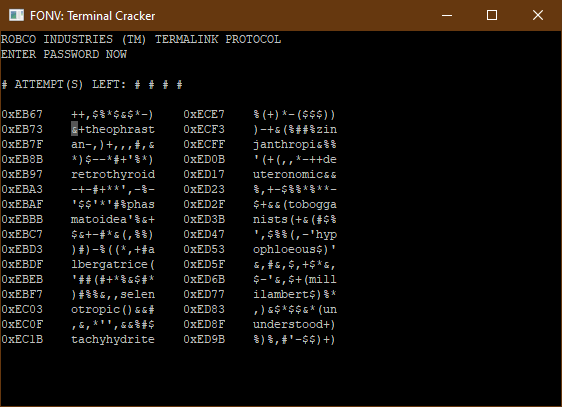
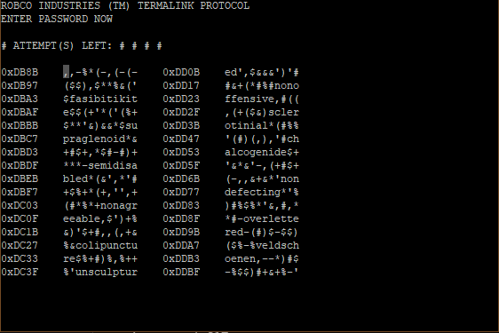
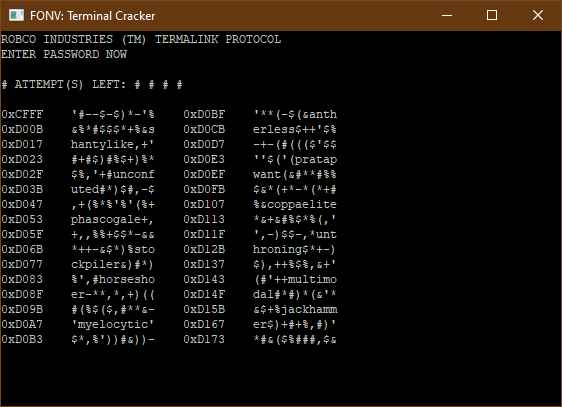
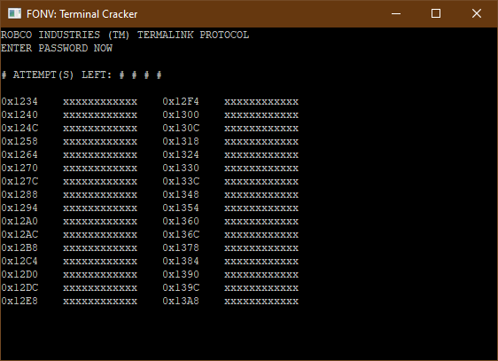
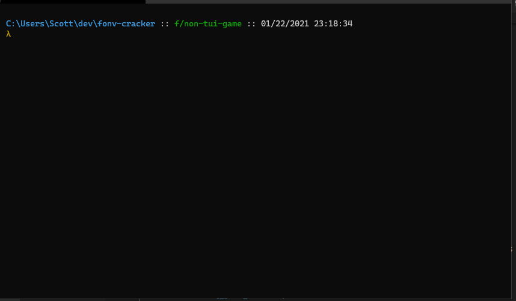
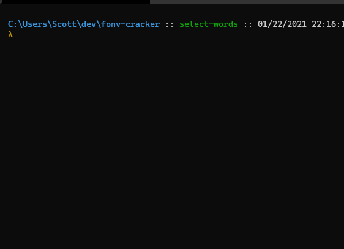

# fonv-cracker

Currently this tool is a helper utility for cracking fallout: new vegas terminals

The plan is to extend it to also be able to play a clone of the cracking game.

## Game Demo Progress

- [Improve the word generation so that in general our words are more similar and match more frequently](https://github.com/scottnm/fonv-cracker/commit/8693452)

- [Support entering in words from the TUI and using that to power a full game loop](https://github.com/scottnm/fonv-cracker/commit/11a9bc4)

- [Added cursor navigation and word selection to the TUI](https://github.com/scottnm/fonv-cracker/commit/1b7074c8)

- [Fill in hex dump screen with selected words and memory noise](https://github.com/scottnm/fonv-cracker/commit/108b30f)

- [Add a mocked out game screen](https://github.com/scottnm/fonv-cracker/commit/1bcb410)

- [Non-TUI version of game loop](https://github.com/scottnm/fonv-cracker/commit/93181fa)

- [Generating words](https://github.com/scottnm/fonv-cracker/commit/bf43b7ce1ba3e12ff41b8950f6de8fe6e9169a57)

